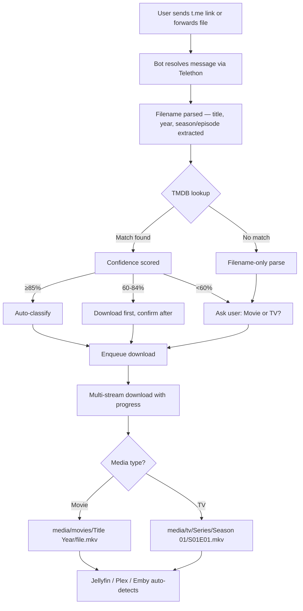

cat > /home/claude/tg-media-bot/README.md << 'EOF'
<div align="center">

# 📡 Telegram Media Bot

**The easiest way to discover and download hard-to-find regional movies and TV shows directly into your media server.**

[](https://github.com/your-username/tg-media-bot/actions/workflows/ci.yml)
[](LICENSE)
[](https://www.python.org/downloads/)
[](CHANGELOG.md)
[](https://hub.docker.com)

*Built for Jellyfin · Plex · Emby — with first-class support for Malayalam, Tamil, Telugu, and all regional Indian cinema*

[Quick Start](#-quick-start) · [Features](#-features) · [How It Works](#-how-it-works) · [FAQ](#-faq) · [Contributing](#-contributing)

</div>

---

## 🎯 Why This Exists

Radarr and Sonarr are great tools — for Western mainstream content. If you watch **regional Indian cinema**, you've already hit the wall:

> You want to watch a Malayalam film from 2018. It exists online. TMDB has the metadata. But Radarr comes up empty because no configured indexer has ever heard of it.

This happens because:
- Most public torrent indexers don't track regional releases
- Metadata for older regional films is sparse or mismatched
- Rare and independent titles simply aren't in indexer databases

**This bot bridges that gap.** You find the file on Telegram — which has an enormous library of regional content in dedicated channels — send the link to your bot, and it downloads, identifies, and organises the file into your Jellyfin/Plex/Emby library automatically.

It doesn't replace Radarr/Sonarr. It complements them for everything they miss.

---

## 👥 Who Is This For?

| User | Problem Solved |
|---|---|
| **Jellyfin / Plex / Emby users** | Auto-organised downloads that appear in your library without manual work |
| **Malayalam cinema fans** | Find and download films that indexers have never heard of |
| **Tamil / Telugu / Kannada fans** | Same — regional content that mainstream tools can't locate |
| **Classic film collectors** | Older titles with incomplete or inconsistent metadata |
| **Self-hosters** | A proper tool that fits into your existing *arr stack |

---

## ✨ Features

### 🔍 Smart Download
Send any `t.me` link or forward a file — the bot resolves it, downloads it at full speed with progress updates, and puts it in the right place.

### 🎬 Auto-Classification
Every file is automatically identified as a movie or TV episode using TMDB metadata with a confidence scoring system. Low-confidence files ask for your confirmation before saving.

### 🌏 Regional Content First
Built with Malayalam, Tamil, Telugu, Hindi, Kannada, Marathi, and Bengali content in mind. Codec tags, language markers, and regional release group names are all correctly handled — they never get confused with episode numbers or titles.

### 📁 Jellyfin-Ready Folder Structure
Files land in `Movies/Title (Year)/` or `TV/Series/Season 01/` — exactly the naming convention Jellyfin, Plex, and Emby expect. Your library just works.

### 📊 Confidence-Based Approval
- **≥85% confidence** → classifies automatically, no interruption
- **60–84%** → downloads, then asks you to confirm the classification
- **<60%** → asks you upfront: 🎬 Movie or 📺 TV?

### 🗄️ Persistent Memory
Once you confirm a title, it's saved forever. The same film will never ask again across restarts, updates, or sessions.

### 👥 Multi-User with Access Control
Approve or deny users via bot commands. Per-user download limits prevent abuse. Admin commands for full control.

### ⚡ Parallel Downloads
Configurable multi-stream downloads (default: 4 parallel connections) for maximum speed on large files.

### 🩺 Health Monitoring
Startup validation for all APIs and storage paths. The bot tells you immediately if something is misconfigured, with clear error messages.

---

## 🚀 Quick Start

**Requirements:** Linux, Python 3.9+

```bash
git clone https://github.com/your-username/tg-media-bot
cd tg-media-bot
chmod +x setup.sh
./setup.sh
```

The setup wizard handles everything:
- Installs Python dependencies
- Asks for your Telegram credentials
- Asks for your media library path
- Writes `.env`
- Runs API health checks
- Generates the systemd service file
- Runs Telethon phone authentication
- Optionally installs the systemd service

After setup completes:

```bash
sudo systemctl start tgbot     # if you chose systemd
# or
python3 tg_downloader_bot.py   # run directly
```

---

## 📋 Before You Start

You need three things from Telegram:

### 1. Bot Token
1. Open Telegram → search **@BotFather**
2. Send `/newbot`, follow the prompts
3. Copy the token (`123456789:ABCdef...`)

### 2. API ID & Hash
1. Go to [my.telegram.org](https://my.telegram.org)
2. Log in → **API development tools** → **Create application**
3. Copy **App api_id** (number) and **App api_hash** (32-char hex)

> These are needed for Telethon, which lets the bot access private channels and resolve forwarded messages. On first run you'll verify your phone number once.

### 3. Your User ID
Message **@userinfobot** on Telegram. It replies with your numeric ID.

### 4. TMDB API Key (strongly recommended)
1. Free account at [themoviedb.org](https://www.themoviedb.org)
2. **Settings → API → Create** → copy the v3 key

---

## 🔧 How It Works



### Step by Step

**1. Link Resolution** — Telethon (the userbot client) resolves the `t.me` link to get the actual Telegram message, including the real filename and file size. This works for public channels, private groups, and forwarded messages.

**2. Filename Parsing** — The filename is stripped of codec tags (`x265`, `HEVC`, `HDR10`, etc.), release group names (`YIFY`, `RARBG`, etc.), language markers, and quality indicators. What remains is a clean title and (if present) year, season, and episode numbers.

**3. TMDB Lookup** — The clean title is searched against TMDB. Results are scored by title similarity, year match, and media type. TVMaze is used as a secondary source for TV episodes.

**4. Confidence Scoring** — Multiple signals are combined: title fuzzy match score, year match, whether episode patterns were found, and provider agreement. The result is a 0–100 confidence score.

**5. Download** — Files are downloaded using Telethon's multi-connection download API with real-time progress reported to your Telegram chat.

**6. Organisation** — The file is moved to the correct folder with a Jellyfin-compatible name. The classification is saved to SQLite so this title is never looked up again.

---

## 📁 Folder Structure

```
tg-media-bot/
├── tg_downloader_bot.py    # Bot entry point — handles Telegram events
├── media_classifier.py     # TMDB classification engine
├── setup.sh                # One-shot installer
├── tgbot.service           # Auto-generated systemd unit
├── Makefile                # Developer shortcuts
├── requirements.txt
├── .env                    # Your credentials (never committed)
├── .env.example            # Template
│
├── config/
│   ├── __init__.py
│   └── settings.py         # All settings loaded from .env
│
├── tests/                  # pytest test suite
│   ├── test_classifier.py
│   ├── test_settings.py
│   └── test_filename_parser.py
│
├── .github/
│   ├── workflows/          # CI/CD pipelines
│   ├── ISSUE_TEMPLATE/     # Bug/feature report templates
│   └── pull_request_template.md
│
├── data/                   # Runtime data (not committed)
│   ├── userbot_session.*   # Telethon auth session
│   ├── users.json          # Approved users
│   ├── media_library.db    # Classified media database
│   └── request_log.db      # Download history
│
├── logs/                   # Log files (not committed)
└── media/                  # Your media library root
    ├── movies/
    │   └── Drishyam (2013)/
    │       └── Drishyam.2013.1080p.mkv
    └── tv/
        └── Panchayat/
            └── Season 01/
                └── Panchayat.S01E01.mkv
```

---

## ⚙️ Configuration Reference

All settings live in `.env`. Generated by `./setup.sh`.

| Variable | Required | Description | Example |
|---|---|---|---|
| `TELEGRAM_BOT_TOKEN` | ✅ | Bot token from @BotFather | `123456:ABC...` |
| `TELEGRAM_API_ID` | ✅ | API ID from my.telegram.org | `12345678` |
| `TELEGRAM_API_HASH` | ✅ | API Hash from my.telegram.org | `abc123...` |
| `TELEGRAM_OWNER_ID` | ✅ | Your Telegram user ID | `707922583` |
| `TMDB_API_KEY` | Recommended | TMDB v3 API key | `abc123...` |
| `TVDB_API_KEY` | Optional | TVDB API key | `abc123...` |
| `MEDIA_PATH` | ✅ | Media library root | `/mnt/media` |
| `DOWNLOAD_PATH` | ✅ | Staging folder for active downloads | `/mnt/media/downloads` |
| `SESSION_PATH` | Auto | Telethon session file (no extension) | `./data/userbot_session` |
| `MEDIA_DB` | Auto | SQLite — classified media | `./data/media_library.db` |
| `REQUEST_LOG_DB` | Auto | SQLite — download history | `./data/request_log.db` |
| `USERS_FILE` | Auto | Approved users list | `./data/users.json` |
| `LOG_FILE` | Auto | Log file path | `./logs/bot.log` |
| `KNOWN_MOVIE_CHANNELS` | Optional | Comma-separated channel IDs to auto-classify as movies | `-1001234,-1005678` |
| `PARALLEL_CONNECTIONS` | Optional | Download streams per file (default: `4`) | `4` |
| `CHUNK_SIZE` | Optional | Download chunk size in bytes (default: `524288`) | `524288` |
| `MAX_QUEUE` | Optional | Max total queued downloads (default: `20`) | `20` |
| `MAX_QUEUE_PER_USER` | Optional | Max queued per user (default: `3`) | `3` |
| `MAX_RETRIES` | Optional | Retry attempts on failure (default: `20`) | `20` |
| `DISK_HEADROOM` | Optional | Minimum free disk to keep in bytes (default: `209715200`) | `209715200` |
| `HISTORY_MAX` | Optional | Downloads shown in /history (default: `50`) | `50` |
| `WATCHDOG_TIMEOUT` | Optional | Seconds before a stalled download is retried (default: `120`) | `120` |

---

## 🤖 Bot Commands

| Command | Who | Description |
|---|---|---|
| `/start` | Everyone | Register and get welcome message |
| `/help` | Users | Full command list |
| `/status` | Users | Active downloads and queue |
| `/queue` | Users | Same as /status |
| `/history` | Users | Last 50 downloads |
| `/storage` | Users | Disk usage |
| `/library` | Users | Browse classified media |
| `/metrics` | Users | Classifier accuracy stats |
| `/cancel` | Users | Cancel your active download |
| `/test-metadata` | Users | Ping TMDB/TVDB |
| `/refresh-metadata [id] [movie\|tv]` | Users | Force re-fetch metadata |
| `/cancelall` | Admin | Cancel all downloads |
| `/users` | Admin | List registered users |
| `/addchannel [id]` | Admin | Add a known movie channel |

---

## 🖥️ Installation Options

### Bare Metal (Ubuntu / Debian)
```bash
git clone https://github.com/your-username/tg-media-bot
cd tg-media-bot
chmod +x setup.sh && ./setup.sh
```

### Bare Metal (Other Linux)
Same as above — setup.sh will skip apt commands if not on Debian/Ubuntu. Install `python3 python3-pip curl` manually first.

### Proxmox LXC
Create an Ubuntu 22.04 LXC container, then run the bare metal steps inside it. Recommended: 1 CPU, 512MB RAM, storage mounted from the host.

### CasaOS
SSH into your CasaOS machine and run the bare metal steps. Point `MEDIA_PATH` to your CasaOS storage mount.

### Unraid
Use the Unraid terminal or an Ubuntu Docker container. Mount your Unraid share as `MEDIA_PATH`.

---

## 🐳 Docker

```bash
# Build
docker build -t tg-media-bot .

# Run
docker run -d \
  --name tg-media-bot \
  --env-file .env \
  -v /your/media:/media \
  -v /your/data:/app/data \
  tg-media-bot
```

### Docker Compose

```yaml
version: "3.8"
services:
  tg-media-bot:
    build: .
    container_name: tg-media-bot
    env_file: .env
    volumes:
      - /your/media:/media
      - ./data:/app/data
      - ./logs:/app/logs
    restart: unless-stopped
```

> **Note:** First-time Telethon auth requires an interactive terminal. Run `docker run -it --env-file .env tg-media-bot python3 auth.py` once to create the session, then switch to detached mode.

---

## 🔗 Media Server Integration

### Jellyfin
Point your Jellyfin library at `MEDIA_PATH/movies` and `MEDIA_PATH/tv`. The folder naming (`Title (Year)` for movies, `Series/Season XX/` for TV) matches Jellyfin's expected structure exactly. Enable **automatic library scanning** in Jellyfin settings.

### Plex
Same paths. Plex works best with its **Plex TV Series (TheTVDB)** and **Plex Movie (TMDB)** agents. The folder structure this bot creates is fully compatible.

### Emby
Same paths. Emby auto-detects new files when library scanning is enabled.

---

## 🔍 Troubleshooting

<details>
<summary><b>Bot doesn't start — "Missing required setting: TELEGRAM_BOT_TOKEN"</b></summary>

`.env` is missing or incomplete. Re-run `./setup.sh`, or manually edit `.env` and fill in the missing value.
</details>

<details>
<summary><b>Telethon session error / phone auth loop</b></summary>

Delete `data/userbot_session.*` and restart. Telethon will prompt for phone + OTP again.
</details>

<details>
<summary><b>Files classified as wrong type (movie saved as TV)</b></summary>

Use the bot's inline keyboard when it asks (🎬 Movie / 📺 TV). The decision is saved permanently. Or use `/refresh-metadata <tmdb_id> movie` to force a specific match.
</details>

<details>
<summary><b>TMDB returns wrong title for a regional film</b></summary>

Use `/refresh-metadata <tmdb_id> movie` with the correct TMDB ID. Find the ID by searching tmdb.org directly.
</details>

<details>
<summary><b>Download stuck / no progress for 2+ minutes</b></summary>

The watchdog will auto-restart stalled downloads after `WATCHDOG_TIMEOUT` seconds (default 120). For persistent issues, check if the source message is still accessible.
</details>

<details>
<summary><b>"Not writable" error for media path</b></summary>

```bash
chown -R $USER:$USER /your/media/path
chmod -R 755 /your/media/path
```
</details>

<details>
<summary><b>Bot works but Jellyfin doesn't see new files</b></summary>

Trigger a library scan in Jellyfin: **Dashboard → Libraries → [your library] → Scan**. Or enable automatic scanning in Jellyfin settings.
</details>

<details>
<summary><b>FloodWait error from Telegram</b></summary>

Telegram is rate-limiting requests. This is handled automatically with exponential backoff — the bot will wait and retry. No action needed.
</details>

<details>
<summary><b>pip3: command not found</b></summary>

```bash
sudo apt install python3-pip   # Debian/Ubuntu
# or
python3 -m ensurepip --upgrade
```
</details>

<details>
<summary><b>Module not found: fuzzywuzzy</b></summary>

```bash
pip3 install fuzzywuzzy python-Levenshtein --break-system-packages
```
</details>

<details>
<summary><b>Service fails with "EnvironmentFile not found"</b></summary>

Re-run `./setup.sh` — it regenerates `tgbot.service` with the correct absolute path to `.env`.
</details>

<details>
<summary><b>Bot receives the link but download never starts</b></summary>

Check disk space: `/status` in the bot. The bot will refuse to download if free disk < `DISK_HEADROOM` (default 200MB).
</details>

<details>
<summary><b>Codec name parsed as episode number (e.g. "x265" → S02E65)</b></summary>

This is fixed in the classifier. If you still see it, check that `media_classifier.py` has been patched by `setup.sh` (look for `from config.settings import settings` near the top).
</details>

<details>
<summary><b>Private channel: "Cannot access message"</b></summary>

Forward the message to your **Saved Messages** in Telegram first, then forward it to the bot. Or use the `t.me/c/CHANNELID/MSGID` link format directly.
</details>

<details>
<summary><b>High memory usage</b></summary>

Reduce `PARALLEL_CONNECTIONS` in `.env` (try `2`). Reduce `CHUNK_SIZE` to `262144` (256KB). The systemd service caps memory at 300MB by default.
</details>

<details>
<summary><b>Bot goes offline silently</b></summary>

Check logs: `sudo journalctl -u tgbot -n 100`. If using systemd, the service restarts automatically after 10 seconds on crash.
</details>

<details>
<summary><b>How do I update the bot?</b></summary>

```bash
git pull
./setup.sh   # re-runs patching and dependency install, keeps your .env
sudo systemctl restart tgbot
```
</details>

<details>
<summary><b>Can I run multiple instances for different libraries?</b></summary>

Yes — clone the repo to a second directory, run `./setup.sh` there with different paths, and use a different bot token. Each instance is fully independent.
</details>

<details>
<summary><b>Session file keeps getting invalidated</b></summary>

This usually means you've logged into the same Telegram account from too many devices. Delete the session and re-auth. Consider creating a secondary Telegram account for the bot.
</details>

<details>
<summary><b>TVDB returns 401 Unauthorized</b></summary>

TVDB API keys expire. Regenerate at [thetvdb.com](https://thetvdb.com/api-information) and update `TVDB_API_KEY` in `.env`, then restart.
</details>

<details>
<summary><b>Daily show episodes (news, talk shows) not classified correctly</b></summary>

The classifier supports `YYYY.MM.DD` date patterns for daily shows. Ensure the filename contains the date in that format.
</details>

<details>
<summary><b>Anime episode numbers wrong</b></summary>

Anime with 3-digit episodes (e.g. `Episode 126`) is supported. If classification is wrong, use the bot's confirmation prompt to correct it and the decision is saved.
</details>

---

## ❓ FAQ

<details>
<summary><b>Is this legal?</b></summary>

The bot is a download tool. What you download and from where is your responsibility. Only download content you have the right to access.
</details>

<details>
<summary><b>Does it work with private Telegram channels?</b></summary>

Yes, as long as your Telegram account (the one used for Telethon auth) is a member of that channel.
</details>

<details>
<summary><b>Why do I need both a bot token AND API credentials?</b></summary>

The bot token powers the command interface (what you type to the bot). The API credentials power Telethon, which is a full Telegram client that can actually download files from channels and resolve forwarded messages — things the Bot API alone cannot do.
</details>

<details>
<summary><b>Is my Telegram account safe?</b></summary>

Telethon uses the official Telegram MTProto API — the same protocol the official apps use. Your credentials are stored locally in `.env` and the session file in `data/`. Never share these files.
</details>

<details>
<summary><b>Can I use this without TMDB?</b></summary>

Yes. Without a TMDB key, files are classified based on filename parsing alone. Classification still works but confidence will be lower and titles won't be enriched with canonical names.
</details>

<details>
<summary><b>How do I add users?</b></summary>

Users can message the bot with `/start`. You'll get an approval request. Use `/users` to see pending requests and approve them.
</details>

<details>
<summary><b>Can multiple people use the same bot instance?</b></summary>

Yes. Each approved user gets their own queue slot (limited by `MAX_QUEUE_PER_USER`).
</details>

<details>
<summary><b>What file types are supported?</b></summary>

Any file Telegram can host — MKV, MP4, AVI, MOV for video; MP3, FLAC, AAC for audio; and documents. There's no server-side type filtering.
</details>

<details>
<summary><b>What's the maximum file size?</b></summary>

Telegram's current limit is 4GB per file for regular accounts, 2GB for bots. The Telethon userbot handles large files correctly.
</details>

<details>
<summary><b>Can I run this on a Raspberry Pi?</b></summary>

Yes. Reduce `PARALLEL_CONNECTIONS` to `2` and `CHUNK_SIZE` to `262144` to limit memory usage.
</details>

<details>
<summary><b>Does it work on Windows?</b></summary>

Not officially tested. The setup wizard is bash-only. The Python code itself should work on Windows with manual dependency installation.
</details>

<details>
<summary><b>How do I back up my data?</b></summary>

Back up the `data/` directory (SQLite databases, session file, users.json) and your `.env` file. Everything else can be regenerated.
</details>

<details>
<summary><b>What happens if a download fails midway?</b></summary>

The bot retries up to `MAX_RETRIES` times (default: 20) with exponential backoff. If all retries fail, you're notified with the error reason.
</details>

<details>
<summary><b>Can I change the folder naming format?</b></summary>

Not currently via config. The naming follows Jellyfin/Plex conventions. PRs welcome for configurable naming templates.
</details>

<details>
<summary><b>Does it support subtitles?</b></summary>

Not yet. Subtitle download is on the roadmap.
</details>

<details>
<summary><b>How does it handle duplicate downloads?</b></summary>

The media database tracks previously classified titles. Re-downloading the same file sends it to the same folder, potentially overwriting the existing file.
</details>

<details>
<summary><b>Can I run it without systemd?</b></summary>

Yes — `python3 tg_downloader_bot.py` runs it directly. Use `screen` or `tmux` to keep it running after logout.
</details>

<details>
<summary><b>What does "auto-classify enabled/DISABLED" mean in the startup message?</b></summary>

If TMDB is unreachable at startup, auto-classification is disabled and every file goes through manual approval mode until TMDB recovers.
</details>

<details>
<summary><b>Can I configure which channels are always treated as movies?</b></summary>

Yes — set `KNOWN_MOVIE_CHANNELS` in `.env` to a comma-separated list of channel IDs. Files from those channels skip the movie/TV question.
</details>

<details>
<summary><b>How do I find a channel's numeric ID?</b></summary>

Forward any message from that channel to @userinfobot, or use `/addchannel` which accepts `@channelname` and resolves it automatically.
</details>

<details>
<summary><b>Is there a web UI?</b></summary>

Not yet — Telegram is the UI. A web dashboard is on the roadmap.
</details>

<details>
<summary><b>How do I completely reset the bot?</b></summary>

```bash
rm -rf data/ logs/
./setup.sh
```
This clears all databases, session, and history. Your `.env` is preserved unless you answer Y to the overwrite prompt.
</details>

---

## 🗺️ Roadmap

- [ ] Web dashboard for queue management and library browsing
- [ ] Automatic subtitle download (OpenSubtitles integration)
- [ ] More regional metadata providers
- [ ] qBittorrent / SABnzbd as alternative download targets
- [ ] Webhook mode for faster response times
- [ ] Docker image on Docker Hub
- [ ] Configurable folder naming templates
- [ ] Mobile-friendly Telegram mini-app
- [ ] AI-assisted title matching for ambiguous regional names

---

## 🤝 Contributing

Contributions are welcome. See [CONTRIBUTING.md](CONTRIBUTING.md) for guidelines.

**Good first issues** are labelled [`good-first-issue`](https://github.com/your-username/tg-media-bot/issues?q=label%3Agood-first-issue) in the issue tracker.

---

## 📄 License

MIT — see [LICENSE](LICENSE).
EOF
echo "done"
